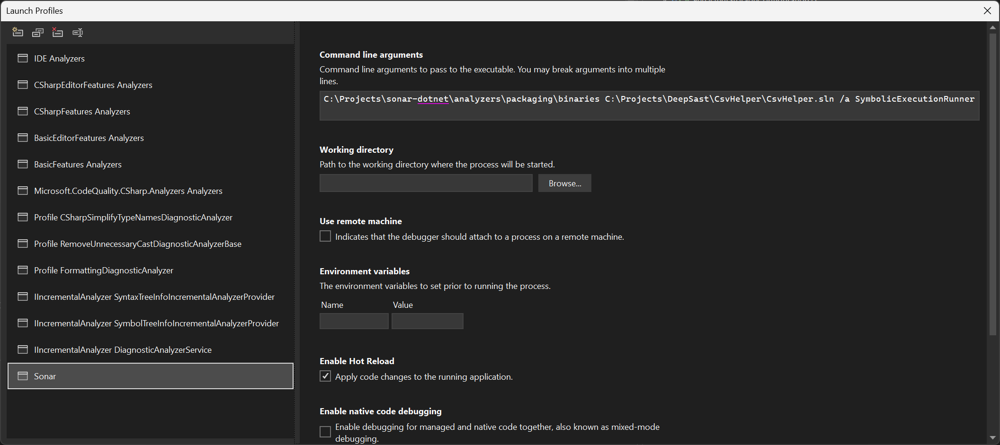

# Analyze a rules performance with the [Visual Studio performance profiler](https://learn.microsoft.com/en-us/visualstudio/profiling)

## Why

Performance problems reported by users are hard to track down. It is important to know how to run a single rule or all rules against a project.

## Option 1: Use the Roslyn Analyzer Runner

The [Roslyn Analyzer Runner](https://github.com/dotnet/roslyn/tree/main/src/Tools/AnalyzerRunner) is an application to run an analyzer on a solution.

### Pre-conditions

1. Check out [Roslyn](https://github.com/dotnet/roslyn) and follow the instructions in the readme to build it.
1. Open the [AnalyzerRunner.csproj](https://github.com/dotnet/roslyn/blob/main/src/Tools/AnalyzerRunner/AnalyzerRunner.csproj) in Visual Studio
1. Add a Launch Profile named "Sonar" (Project settings → Debug → General → "Open debug launch profiles UI" or open "Properties/launchSettings.json" in the Solution Explorer)
1. In the Command line arguments specify `C:\Projects\sonar-dotnet\analyzers\packaging\binaries C:\Projects\CsvHelper\CsvHelper.sln /a SymbolicExecutionRunner` (In this case the analyzer found in the "binaries" directory will run against the CsvHelper solution. Only the SymbolicExecutionRunner analyzer will be executed)

### Start a performance analysis with Visual Studio

1. Make sure, you build the correct version of the sonar-dotnet analyzer in Release mode. The release dlls will be placed in the `C:\Projects\sonar-dotnet\analyzers\packaging\binaries` folder.
1. Specify the project you want to run the analyzer against in the "Sonar" launch profile (see above). Also, specify the class name of the analyzer to run (you can specify more than one analyzer or run all analyzers).
1. Open the *Performance profiler*: Debug → "Performance profiler.." or press Alt+F2
1. Check the tools you want to use during profiling.
1. Press start

**Tip:** The analyzer runner waits 5 seconds before the actual run begins. You can use this to start with "collection paused" and start collection within this 5 seconds.

